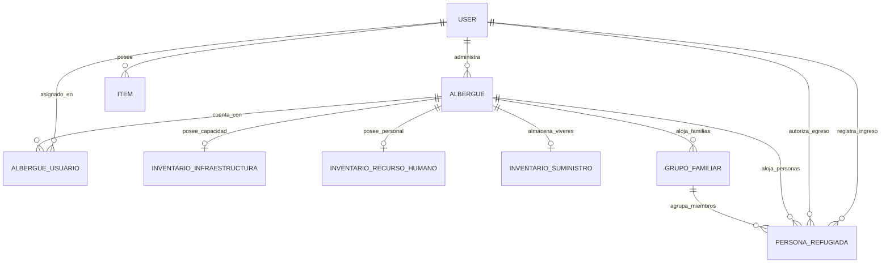

# ESTRUCTURA TECNICA DE TABLAS Y ESQUEMA DE BASE DE DATOS
> SISTEMA SIGRAS - PROTECCION CIVIL / HACKATEC 2026
> Documento tecnico parseado de las tablas fisicas en PostgreSQL (Supabase) y modelos de dominio.

---

## 1. RESUMEN EJECUTIVO DEL ESQUEMA FISICO

La base de datos en Supabase cuenta actualmente con **11 tablas fisicas** en el esquema `public`:

| Tabla Fisica | Total Filas | Rol Operativo en la Contingencia | Relacion Principal |
| :--- | :---: | :--- | :--- |
| `albergue` | 5 | Refugios temporales habilitados en Tampico/Madero | Pertenece a un responsable (`user.id`) |
| `albergue_usuario` | 0 | Asignacion de personal y brigadistas a refugios | Intermedia entre `albergue` y `user` |
| `alerta_zona_riesgo` | 2 | Puntos y poligonos de inundacion / bloqueo vial | Independiente (Geoespacial) |
| `grupo_familiar` | 0 | Censos de nucleos familiares acogidos | Depende de `albergue.id` |
| `inventario_infraestructura` | 0 | Capacidad fisica, banos, cocina, accesibilidad | 1 a 1 con `albergue.id` |
| `inventario_recurso_humano` | 0 | Plantilla medica, operativa y voluntariado | 1 a 1 con `albergue.id` |
| `inventario_suministro` | 0 | Conteo de viveres, agua, colchonetas y medicinas | 1 a 1 con `albergue.id` |
| `persona_refugiada` | 0 | Censo nominal y triaje individual de evacuados | Pertenece a `albergue` y `grupo_familiar` |
| `user` | 1 | Operadores, coordinadores y brigadistas del sistema | Superadministrador activo verificado |
| `item` | 0 | Tabla residual del boilerplate original FastAPI | Depende de `user.id` |
| `alembic_version` | 1 | Registro de migraciones aplicadas | Tabla tecnica del sistema |

---

## 2. DIAGRAMA CONCEPTUAL DE RELACIONES (ENTIDAD - RELACION)

---

## 3. DESGLOSE DETALLADO TABLA POR TABLA

### 3.1 Tabla: `albergue`
* **Total de Filas Actuales:** `5`
* **Proposito Operativo:** Registro maestro de inmuebles habilitados como refugios temporales de emergencia en la zona conurbada.
* **Clave Primaria (Primary Key):** `id`
* **Claves Foraneas (Foreign Keys):**
  - `responsable_id` ➔ referencia a `user.id`
* **Indices Existentes:** `ix_albergue_estado_operativo` (estado_operativo), `ix_albergue_folio_identificador` (folio_identificador) (UNIQUE), `ix_albergue_municipio` (municipio), `ix_albergue_nombre` (nombre)

| Columna | Tipo de Dato Fisica | Nulo | Default | Restriccion | Descripcion Funcional |
| :--- | :--- | :---: | :---: | :---: | :--- |
| `id` | `UUID` | **NOT NULL** | - | PK | Identificador unico universal (UUID v4) del albergue. |
| `folio_identificador` | `VARCHAR(50)` | **NOT NULL** | - | UNIQUE | Codigo oficial de control administrativo de Proteccion Civil (ej. ALB-TAM-001). |
| `nombre` | `VARCHAR(255)` | **NOT NULL** | - | - | Nombre descriptivo del inmueble (ej. Auditorio Municipal, Polideportivo Oriente). |
| `direccion` | `VARCHAR(500)` | **NOT NULL** | - | - | Domicilio fisico completo con calle, numero y colonia. |
| `municipio` | `VARCHAR(150)` | **NOT NULL** | - | - | Municipio de radicacion (Tampico, Ciudad Madero, Altamira). |
| `localidad` | `VARCHAR(150)` | NULL | - | - | Colonia, asentamiento o ejido especifico. |
| `estado_republica` | `VARCHAR(100)` | **NOT NULL** | - | - | Entidad federativa (Tamaulipas / Veracruz). |
| `latitud` | `DOUBLE PRECISION` | NULL | - | - | Coordenada geografica de latitud en formato WGS84 para navegacion Mapbox. |
| `longitud` | `DOUBLE PRECISION` | NULL | - | - | Coordenada geografica de longitud en formato WGS84 para navegacion Mapbox. |
| `tipo_inmueble` | `VARCHAR(100)` | NULL | - | - | Clasificacion fisica del edificio (Escuela, Gimnasio, Centro Comunitario, Auditorio). |
| `telefono_contacto` | `VARCHAR(50)` | NULL | - | - | Linea telefonica directa de atencion o recepcion. |
| `admite_mascotas` | `BOOLEAN` | **NOT NULL** | - | - | Booleano que autoriza la aceptacion de animales de compania en zona adaptada. |
| `estado_operativo` | `VARCHAR(17)` | **NOT NULL** | - | - | Estado operativo actual: planeado, disponible, activado, lleno, cerrado, fuera_de_servicio. |
| `observaciones` | `VARCHAR(1000)` | NULL | - | - | Anotaciones sobre condiciones de acceso, vias o recomendaciones de uso. |
| `responsable_id` | `UUID` | NULL | - | FK -> `user` | Enlace al usuario operador o coordinador responsable del albergue. |
| `fecha_registro` | `TIMESTAMP` | **NOT NULL** | - | - | Marca de tiempo de creacion en el sistema (UTC). |
| `fecha_actualizacion` | `TIMESTAMP` | **NOT NULL** | - | - | Marca de tiempo del ultimo corte o edicion de datos. |
| `ocupacion_actual` | `INTEGER` | **NOT NULL** | `0` | - | Campo operativo de la tabla. |

---

### 3.2 Tabla: `albergue_usuario`
* **Total de Filas Actuales:** `0`
* **Proposito Operativo:** Tabla intermedia para gestionar los turnos, roles especificos y brigadas de usuarios dentro de un albergue.
* **Clave Primaria (Primary Key):** `id`
* **Claves Foraneas (Foreign Keys):**
  - `albergue_id` ➔ referencia a `albergue.id`
  - `usuario_id` ➔ referencia a `user.id`
* **Indices Existentes:** `ix_albergue_usuario_albergue_id` (albergue_id), `ix_albergue_usuario_area` (area), `ix_albergue_usuario_rol` (rol), `ix_albergue_usuario_usuario_id` (usuario_id)

| Columna | Tipo de Dato Fisica | Nulo | Default | Restriccion | Descripcion Funcional |
| :--- | :--- | :---: | :---: | :---: | :--- |
| `id` | `UUID` | **NOT NULL** | - | PK | Identificador unico de la asignacion de personal. |
| `albergue_id` | `UUID` | **NOT NULL** | - | FK -> `albergue` | Clave foranea que referencia al albergue asignado. |
| `usuario_id` | `UUID` | **NOT NULL** | - | FK -> `user` | Clave foranea que referencia al usuario o brigadista operativo. |
| `rol` | `VARCHAR(22)` | **NOT NULL** | - | - | Rol desempenado en este centro (coordinador, medico, enfermero, bodeguero, etc.). |
| `area` | `VARCHAR(22)` | **NOT NULL** | - | - | Area operativa asignada (recepcion, salud, cocina, seguridad, logistica). |
| `activo` | `BOOLEAN` | **NOT NULL** | - | - | Bandera de estado que indica si la persona esta de turno o comisionada actualmente. |
| `fecha_asignacion` | `TIMESTAMP` | **NOT NULL** | - | - | Fecha y hora de asignacion de la guardia o brigada. |

---

### 3.3 Tabla: `alembic_version`
* **Total de Filas Actuales:** `1`
* **Proposito Operativo:** Tabla de control interno del motor de migraciones de Alembic.
* **Clave Primaria (Primary Key):** `version_num`
* **Claves Foraneas (Foreign Keys):** Ninguna

| Columna | Tipo de Dato Fisica | Nulo | Default | Restriccion | Descripcion Funcional |
| :--- | :--- | :---: | :---: | :---: | :--- |
| `version_num` | `VARCHAR(32)` | **NOT NULL** | - | PK | Identificador alfanumerico del hash de revision de la migracion actual. |

---

### 3.4 Tabla: `alerta_zona_riesgo`
* **Total de Filas Actuales:** `2`
* **Proposito Operativo:** Alertas hidrometeorologicas, desbordamientos de rios y bloqueos de vialidades que alimentan el mapa y el calculador de rutas seguras.
* **Clave Primaria (Primary Key):** `id`
* **Claves Foraneas (Foreign Keys):** Ninguna
* **Indices Existentes:** `alerta_zona_riesgo_codigo_alerta_key` (codigo_alerta) (UNIQUE)

| Columna | Tipo de Dato Fisica | Nulo | Default | Restriccion | Descripcion Funcional |
| :--- | :--- | :---: | :---: | :---: | :--- |
| `id` | `UUID` | **NOT NULL** | - | PK | Identificador unico universal de la alerta. |
| `codigo_alerta` | `VARCHAR(50)` | **NOT NULL** | - | UNIQUE | Codigo o folio oficial del boletin de alerta (ej. ALT-HIDRO-001). |
| `titulo` | `VARCHAR(255)` | **NOT NULL** | - | - | Titulo conciso del evento (ej. Calle inundada 65 cm, Crecida Rio Panuco). |
| `tipo_fenomeno` | `VARCHAR(100)` | NULL | `'Hidrometeorologico'::character varying` | - | Clase de fenomeno perturbador (Inundacion severa, Encharcamiento, Deslave, Vía cerrada). |
| `nivel_alerta` | `VARCHAR(8)` | NULL | `'amarillo'::nivelalertariesgo` | - | Semaforo de severidad: verde, amarillo, naranja, rojo. |
| `descripcion` | `VARCHAR(2000)` | **NOT NULL** | - | - | Detalle tecnico de la afectacion, tirante de agua estimado y vias alternas. |
| `cuenca_rio` | `VARCHAR(150)` | NULL | - | - | Nombre de la cuenca, laguna o cuerpo de agua relacionado (ej. Rio Panuco, Laguna del Carpintero). |
| `nivel_actual_metros` | `DOUBLE PRECISION` | NULL | - | - | Lectura hidrometrica actual en escala metrica. |
| `nivel_critico_desbordamiento` | `DOUBLE PRECISION` | NULL | - | - | Cota de escala a partir de la cual ocurre desbordamiento en zonas habitadas. |
| `municipios_afectados` | `VARCHAR(1000)` | NULL | - | - | Listado de demarcaciones o colonias bajo impacto. |
| `latitud_referencia` | `DOUBLE PRECISION` | NULL | - | - | Punto central de latitud del bloqueo o zona de riesgo. |
| `longitud_referencia` | `DOUBLE PRECISION` | NULL | - | - | Punto central de longitud del bloqueo o zona de riesgo. |
| `radio_afectacion_km` | `DOUBLE PRECISION` | NULL | - | - | Radio de influencia geografica en kilometros para evitar enrutamiento. |
| `activo` | `BOOLEAN` | NULL | `true` | - | Estatus de la alerta en tiempo real (True = amenaza activa). |
| `fecha_emision` | `TIMESTAMP` | **NOT NULL** | - | - | Marca temporal de publicacion de la alerta. |
| `fecha_vigencia` | `TIMESTAMP` | NULL | - | - | Fecha estimada de finalizacion del alertamiento. |

---

### 3.5 Tabla: `grupo_familiar`
* **Total de Filas Actuales:** `0`
* **Proposito Operativo:** Registro de cohesion de familias damnificadas para mantener unidas a las personas durante la asignacion de dormitorios y viveres.
* **Clave Primaria (Primary Key):** `id`
* **Claves Foraneas (Foreign Keys):**
  - `albergue_id` ➔ referencia a `albergue.id`
* **Indices Existentes:** `ix_grupo_familiar_albergue_id` (albergue_id), `ix_grupo_familiar_codigo_familia` (codigo_familia)

| Columna | Tipo de Dato Fisica | Nulo | Default | Restriccion | Descripcion Funcional |
| :--- | :--- | :---: | :---: | :---: | :--- |
| `id` | `UUID` | **NOT NULL** | - | PK | Identificador unico del grupo familiar. |
| `albergue_id` | `UUID` | **NOT NULL** | - | FK -> `albergue` | Albergue en el cual se encuentra instalada la familia. |
| `codigo_familia` | `VARCHAR(50)` | **NOT NULL** | - | - | Folio unico de nucleo familiar para control en puerta (ej. FAM-TAM-012). |
| `nombre_referente` | `VARCHAR(255)` | **NOT NULL** | - | - | Nombre y apellidos del tutor, padre, madre o jefe de familia responsable. |
| `total_integrantes` | `INTEGER` | **NOT NULL** | - | - | Cantidad total de integrantes que conforman el grupo familiar. |
| `comunidad_origen` | `VARCHAR(255)` | NULL | - | - | Colonia, sector o municipio del que provienen evacuados. |
| `necesidades_especiales` | `VARCHAR(500)` | NULL | - | - | Descripcion de necesidades medicas, lactancia, medicamentos cronicos o cuidados. |
| `fecha_registro` | `TIMESTAMP` | **NOT NULL** | - | - | Marca temporal del arribo y recepcion de la familia. |

---

### 3.6 Tabla: `inventario_infraestructura`
* **Total de Filas Actuales:** `2`
* **Proposito Operativo:** Capacidad instalada, balance hidraulico y dictamen de seguridad estructural de cada albergue (Relacion 1 a 1).
* **Clave Primaria (Primary Key):** `id`
* **Claves Foraneas (Foreign Keys):**
  - `albergue_id` ➔ referencia a `albergue.id`
* **Indices Existentes:** `inventario_infraestructura_albergue_id_key` (albergue_id) (UNIQUE), `ix_inventario_infraestructura_albergue_id` (albergue_id) (UNIQUE)

| Columna | Tipo de Dato Fisica | Nulo | Default | Restriccion | Descripcion Funcional |
| :--- | :--- | :---: | :---: | :---: | :--- |
| `id` | `UUID` | **NOT NULL** | - | PK | Identificador unico del registro de infraestructura. |
| `albergue_id` | `UUID` | **NOT NULL** | - | FK -> `albergue` | UNIQUE | UNIQUE | Albergue al que pertenece la infraestructura evaluada. |
| `capacidad_maxima` | `INTEGER` | **NOT NULL** | - | - | Aforo maximo nominal de personas que pueden pernoctar con seguridad. |
| `dormitorios` | `INTEGER` | **NOT NULL** | - | - | Numero de salones o naves acondicionadas como dormitorios. |
| `banos` | `INTEGER` | **NOT NULL** | - | - | Cantidad de sanitarios higienicos funcionales. |
| `regaderas` | `INTEGER` | **NOT NULL** | - | - | Numero de regaderas para aseo corporal disponibles. |
| `cocina` | `INTEGER` | **NOT NULL** | - | - | Numero de estufas o areas habilitadas para preparacion de alimentos calientes. |
| `comedor` | `INTEGER` | **NOT NULL** | - | - | Capacidad o modulos de comedor comunitario. |
| `consultorio` | `INTEGER` | **NOT NULL** | - | - | Modulos dedicados para triaje medico y primeros auxilios. |
| `bodega` | `INTEGER` | **NOT NULL** | - | - | Espacios secos y seguros destinados a almacenamiento de viveres. |
| `salidas_emergencia` | `INTEGER` | **NOT NULL** | - | - | Puertas de escape senalizadas y despejadas. |
| `extintores_instalados` | `INTEGER` | **NOT NULL** | - | - | Campo operativo de la tabla. |
| `accesos_silla_ruedas` | `BOOLEAN` | **NOT NULL** | - | - | Indicador si cuenta con rampas y accesibilidad universal. |
| `planta_electrica` | `BOOLEAN` | **NOT NULL** | - | - | Existencia de generador electrico auxiliar ante cortes de luz. |
| `sistema_agua` | `VARCHAR(100)` | **NOT NULL** | - | - | Modo de suministro de agua (red_publica, cisterna, pozo, pipa). |
| `estado_inmueble` | `VARCHAR(100)` | **NOT NULL** | - | - | Dictamen estructural de Proteccion Civil (optimo, bueno, regular, etc.). |
| `fecha_actualizacion` | `TIMESTAMP` | **NOT NULL** | - | - | Fecha de la ultima inspeccion fisica del inmueble. |

---

### 3.7 Tabla: `inventario_recurso_humano`
* **Total de Filas Actuales:** `1`
* **Proposito Operativo:** Conteo y distribucion por especialidad del personal desplegado en el refugio (Relacion 1 a 1).
* **Clave Primaria (Primary Key):** `id`
* **Claves Foraneas (Foreign Keys):**
  - `albergue_id` ➔ referencia a `albergue.id`
* **Indices Existentes:** `inventario_recurso_humano_albergue_id_key` (albergue_id) (UNIQUE), `ix_inventario_recurso_humano_albergue_id` (albergue_id) (UNIQUE)

| Columna | Tipo de Dato Fisica | Nulo | Default | Restriccion | Descripcion Funcional |
| :--- | :--- | :---: | :---: | :---: | :--- |
| `id` | `UUID` | **NOT NULL** | - | PK | Identificador unico del censo de recursos humanos. |
| `albergue_id` | `UUID` | **NOT NULL** | - | FK -> `albergue` | UNIQUE | UNIQUE | Albergue al que esta adscrito este equipo de trabajo. |
| `administrador` | `INTEGER` | **NOT NULL** | - | - | Conteo de coordinadores generales de refugio presentes. |
| `medicos` | `INTEGER` | **NOT NULL** | - | - | Medicos titulados en turno activo. |
| `enfermeria` | `INTEGER` | **NOT NULL** | - | - | Personal de enfermeria y primeros auxilios. |
| `psicologia` | `INTEGER` | **NOT NULL** | - | - | Profesionales de intervencion en crisis y apoyo emocional. |
| `cocineros` | `INTEGER` | **NOT NULL** | - | - | Personal asignado a preparacion y racionamiento de comida. |
| `personal_limpieza` | `INTEGER` | **NOT NULL** | - | - | Personal de intendencia, sanitizacion y manejo de residuos. |
| `seguridad` | `INTEGER` | **NOT NULL** | - | - | Guardias municipales, policias o personal de control de accesos. |
| `trabajadores_sociales` | `INTEGER` | **NOT NULL** | - | - | Trabajadores sociales para censo y vinculacion familiar. |
| `traductores` | `INTEGER` | **NOT NULL** | - | - | Interpretes de lenguas originarias o idiomas extranjeros. |
| `voluntarios` | `INTEGER` | **NOT NULL** | - | - | Voluntarios acreditados de la sociedad civil. |
| `conductores` | `INTEGER` | **NOT NULL** | - | - | Choferes asignados a ambulancias, vans y transporte de evacudados. |
| `responsables_bodega` | `INTEGER` | **NOT NULL** | - | - | Encargados de recepcion de donativos y entrega de suministros. |
| `fecha_actualizacion` | `TIMESTAMP` | **NOT NULL** | - | - | Marca temporal del ultimo pase de lista operativo. |

---

### 3.8 Tabla: `inventario_suministro`
* **Total de Filas Actuales:** `2`
* **Proposito Operativo:** Balance consolidado de viveres, abrigo, medicamentos y herramientas almacenadas en el refugio (Relacion 1 a 1).
* **Clave Primaria (Primary Key):** `id`
* **Claves Foraneas (Foreign Keys):**
  - `albergue_id` ➔ referencia a `albergue.id`
* **Indices Existentes:** `inventario_suministro_albergue_id_key` (albergue_id) (UNIQUE), `ix_inventario_suministro_albergue_id` (albergue_id) (UNIQUE)

| Columna | Tipo de Dato Fisica | Nulo | Default | Restriccion | Descripcion Funcional |
| :--- | :--- | :---: | :---: | :---: | :--- |
| `id` | `UUID` | **NOT NULL** | - | PK | Identificador unico del inventario de suministros. |
| `albergue_id` | `UUID` | **NOT NULL** | - | FK -> `albergue` | UNIQUE | UNIQUE | Albergue depositario de los insumos. |
| `agua_potable` | `DOUBLE PRECISION` | **NOT NULL** | - | - | Volumen en litros de agua purificada disponible para consumo. |
| `alimentos_no_perecederos` | `INTEGER` | **NOT NULL** | - | - | Raciones o paquetes de comida enlatada y no perecedera. |
| `formula_infantil` | `INTEGER` | **NOT NULL** | - | - | Latas de leche maternizada para bebes y lactantes. |
| `medicamentos_basicos` | `INTEGER` | **NOT NULL** | - | - | Unidades o cajas de analgesicos, antibioticos y suero oral. |
| `material_curacion` | `INTEGER` | **NOT NULL** | - | - | Paquetes de gasas, vendas, alcohol, antisepticos y guantes. |
| `cobijas` | `INTEGER` | **NOT NULL** | - | - | Piezas de frazadas o cobijas termicas limpias. |
| `colchonetas` | `INTEGER` | **NOT NULL** | - | - | Colchonetas de hule espuma o vinil para descanso. |
| `ropa` | `INTEGER` | **NOT NULL** | - | - | Prendas de vestir ordenadas por talla y genero. |
| `kits_higiene` | `INTEGER` | **NOT NULL** | - | - | Paquetes personales con jabon, pasta dental, cepillo y toalla. |
| `panales` | `INTEGER` | **NOT NULL** | - | - | Paquetes de panales para infantes y adultos mayores. |
| `cubrebocas` | `INTEGER` | **NOT NULL** | - | - | Mascarillas quirurgicas o KN95 para prevencion sanitaria. |
| `productos_limpieza` | `INTEGER` | **NOT NULL** | - | - | Cloro, detergentes, escobas y desinfectante ambiental. |
| `bolsas_residuos` | `INTEGER` | **NOT NULL** | - | - | Rollos de bolsas de plastico grueso para desechos biologicos y comunes. |
| `linternas` | `INTEGER` | **NOT NULL** | - | - | Linternas manuales o reflectores recargables. |
| `pilas` | `INTEGER` | **NOT NULL** | - | - | Pilas secas de distintos calibres (AA, AAA, D). |
| `extintores_reserva` | `INTEGER` | **NOT NULL** | - | - | Campo operativo de la tabla. |
| `herramientas` | `INTEGER` | **NOT NULL** | - | - | Juegos de palas, carretillas, zapapicos, martillos y desarmadores. |
| `material_oficina` | `INTEGER` | **NOT NULL** | - | - | Papeleria, carpetas, gafetes y plumas para el registro censal. |
| `fecha_actualizacion` | `TIMESTAMP` | **NOT NULL** | - | - | Marca de tiempo del ultimo balance de almacen. |

---

### 3.9 Tabla: `item`
* **Total de Filas Actuales:** `0`
* **Proposito Operativo:** Tabla heredada de la plantilla base de FastAPI (Full-Stack Template). No cumple funcion en SIGRAS.
* **Clave Primaria (Primary Key):** `id`
* **Claves Foraneas (Foreign Keys):**
  - `owner_id` ➔ referencia a `user.id`

| Columna | Tipo de Dato Fisica | Nulo | Default | Restriccion | Descripcion Funcional |
| :--- | :--- | :---: | :---: | :---: | :--- |
| `description` | `VARCHAR(255)` | NULL | - | - | Descripcion del item de prueba. |
| `title` | `VARCHAR(255)` | **NOT NULL** | - | - | Titulo del item de prueba. |
| `id` | `UUID` | **NOT NULL** | - | PK | Identificador UUID del item. |
| `owner_id` | `UUID` | **NOT NULL** | - | FK -> `user` | Clave foranea que referencia a user.id. |
| `created_at` | `TIMESTAMP` | NULL | - | - | Fecha de creacion. |

---

### 3.10 Tabla: `persona_refugiada`
* **Total de Filas Actuales:** `3`
* **Proposito Operativo:** Padron nominal individualizado de cada ciudadano evacuado, registrando triaje medico, vulnerabilidades, ubicacion de pernocta y salida.
* **Clave Primaria (Primary Key):** `id`
* **Claves Foraneas (Foreign Keys):**
  - `albergue_id` ➔ referencia a `albergue.id`
  - `egreso_por_id` ➔ referencia a `user.id`
  - `grupo_familiar_id` ➔ referencia a `grupo_familiar.id`
  - `registrado_por_id` ➔ referencia a `user.id`
* **Indices Existentes:** `ix_persona_refugiada_albergue_id` (albergue_id), `ix_persona_refugiada_curp` (curp), `ix_persona_refugiada_estado_estancia` (estado_estancia), `ix_persona_refugiada_folio_identificacion` (folio_identificacion) (UNIQUE), `ix_persona_refugiada_grupo_familiar_id` (grupo_familiar_id)

| Columna | Tipo de Dato Fisica | Nulo | Default | Restriccion | Descripcion Funcional |
| :--- | :--- | :---: | :---: | :---: | :--- |
| `id` | `UUID` | **NOT NULL** | - | PK | Identificador unico universal de la persona refugiada. |
| `albergue_id` | `UUID` | **NOT NULL** | - | FK -> `albergue` | Albergue en el que se encuentra alojada la persona. |
| `grupo_familiar_id` | `UUID` | NULL | - | FK -> `grupo_familiar` | Enlace a la familia a la que pertenece (opcional si viaja sola). |
| `folio_identificacion` | `VARCHAR(50)` | **NOT NULL** | - | UNIQUE | Folio unico individual de ingreso (ej. REF-2026-0045). |
| `nombre` | `VARCHAR(150)` | **NOT NULL** | - | - | Nombre o nombres de pila de la persona. |
| `apellido_paterno` | `VARCHAR(150)` | **NOT NULL** | - | - | Primer apellido. |
| `apellido_materno` | `VARCHAR(150)` | NULL | - | - | Segundo apellido. |
| `curp` | `VARCHAR(20)` | NULL | - | - | Clave Unica de Registro de Poblacion de Mexico. |
| `fecha_nacimiento` | `TIMESTAMP` | NULL | - | - | Fecha de nacimiento registrada. |
| `genero` | `VARCHAR(30)` | NULL | - | - | Genero (masculino, femenino, otro). |
| `municipio_origen` | `VARCHAR(150)` | NULL | - | - | Municipio de donde fue evacuada la persona. |
| `localidad_origen` | `VARCHAR(150)` | NULL | - | - | Colonia, barrio o poblado de residencia original. |
| `telefono_contacto` | `VARCHAR(50)` | NULL | - | - | Telefono personal si se cuenta con comunicacion. |
| `contacto_emergencia_nombre` | `VARCHAR(255)` | NULL | - | - | Nombre de un pariente o contacto externo no damnificado. |
| `contacto_emergencia_telefono` | `VARCHAR(50)` | NULL | - | - | Telefono del contacto externo de emergencia. |
| `condicion_medica` | `VARCHAR(500)` | NULL | - | - | Padecimientos preexistentes (diabetes, hipertension, dialisis, etc.). |
| `discapacidad` | `BOOLEAN` | **NOT NULL** | - | - | Indicador de discapacidad motriz, visual, auditiva o intelectual. |
| `embarazo` | `BOOLEAN` | **NOT NULL** | - | - | Indicador de estado de gestacion activo. |
| `adulto_mayor` | `BOOLEAN` | **NOT NULL** | - | - | Indicador si la persona tiene 60 anos o mas. |
| `menor_de_edad` | `BOOLEAN` | **NOT NULL** | - | - | Indicador si la persona es menor a 18 anos. |
| `necesidad_especial` | `VARCHAR(500)` | NULL | - | - | Detalle sobre dietas, medicamentos de rescate o atencion prioritaria. |
| `dormitorio_asignado` | `VARCHAR(100)` | NULL | - | - | Salon, carpa o aula donde duerme la persona. |
| `numero_cama_colchoneta` | `VARCHAR(50)` | NULL | - | - | Numero o etiqueta de colchoneta/cama asignada. |
| `estado_estancia` | `VARCHAR(17)` | **NOT NULL** | - | - | Estatus en el albergue: ingresado, en_albergue, egresado, trasladado. |
| `motivo_salida` | `VARCHAR(255)` | NULL | - | - | Motivo del retiro (Retorno a domicilio, traslado a hospital, con parientes). |
| `destino_salida` | `VARCHAR(255)` | NULL | - | - | Direccion o ciudad hacia donde partio la persona al salir. |
| `observaciones` | `VARCHAR(1000)` | NULL | - | - | Anotaciones medicas, psicologicas o legales relevantes. |
| `registrado_por_id` | `UUID` | NULL | - | FK -> `user` | Usuario o brigadista que capturo el ingreso. |
| `egreso_por_id` | `UUID` | NULL | - | FK -> `user` | Usuario o autoridad que autorizo y registro el egreso. |
| `fecha_ingreso` | `TIMESTAMP` | **NOT NULL** | - | - | Momento exacto en que fue recibida la persona. |
| `fecha_salida` | `TIMESTAMP` | NULL | - | - | Momento en que concluyo su estancia en el refugio. |

---

### 3.11 Tabla: `reporte_ciudadano`
* **Total de Filas Actuales:** `0`
* **Proposito Operativo:** Sin descripcion disponible.
* **Clave Primaria (Primary Key):** `id`
* **Claves Foraneas (Foreign Keys):**
  - `brigada_asignada_id` ➔ referencia a `user.id`
* **Indices Existentes:** `ix_reporte_ciudadano_estado_reporte` (estado_reporte), `ix_reporte_ciudadano_folio_reporte` (folio_reporte) (UNIQUE), `ix_reporte_ciudadano_latitud` (latitud), `ix_reporte_ciudadano_longitud` (longitud), `ix_reporte_ciudadano_municipio` (municipio), `ix_reporte_ciudadano_nivel_prioridad` (nivel_prioridad), `ix_reporte_ciudadano_tipo_emergencia` (tipo_emergencia)

| Columna | Tipo de Dato Fisica | Nulo | Default | Restriccion | Descripcion Funcional |
| :--- | :--- | :---: | :---: | :---: | :--- |
| `id` | `UUID` | **NOT NULL** | - | PK | Campo operativo de la tabla. |
| `folio_reporte` | `VARCHAR(50)` | **NOT NULL** | - | UNIQUE | Campo operativo de la tabla. |
| `tipo_emergencia` | `VARCHAR(23)` | **NOT NULL** | - | - | Campo operativo de la tabla. |
| `descripcion` | `VARCHAR(2000)` | **NOT NULL** | - | - | Campo operativo de la tabla. |
| `latitud` | `DOUBLE PRECISION` | **NOT NULL** | - | - | Campo operativo de la tabla. |
| `longitud` | `DOUBLE PRECISION` | **NOT NULL** | - | - | Campo operativo de la tabla. |
| `direccion_referencia` | `VARCHAR(500)` | **NOT NULL** | - | - | Campo operativo de la tabla. |
| `municipio` | `VARCHAR(150)` | **NOT NULL** | - | - | Campo operativo de la tabla. |
| `localidad` | `VARCHAR(150)` | NULL | - | - | Campo operativo de la tabla. |
| `nivel_prioridad` | `VARCHAR(22)` | **NOT NULL** | - | - | Campo operativo de la tabla. |
| `estado_reporte` | `VARCHAR(16)` | **NOT NULL** | - | - | Campo operativo de la tabla. |
| `personas_afectadas` | `INTEGER` | **NOT NULL** | `1` | - | Campo operativo de la tabla. |
| `personas_vulnerables` | `INTEGER` | **NOT NULL** | `0` | - | Campo operativo de la tabla. |
| `telefono_contacto` | `VARCHAR(50)` | NULL | - | - | Campo operativo de la tabla. |
| `url_evidencia_multimedia` | `VARCHAR(1000)` | NULL | - | - | Campo operativo de la tabla. |
| `brigada_asignada_id` | `UUID` | NULL | - | FK -> `user` | Campo operativo de la tabla. |
| `fecha_reporte` | `TIMESTAMP` | **NOT NULL** | `now()` | - | Campo operativo de la tabla. |
| `fecha_atencion` | `TIMESTAMP` | NULL | - | - | Campo operativo de la tabla. |

---

### 3.12 Tabla: `user`
* **Total de Filas Actuales:** `3`
* **Proposito Operativo:** Usuarios, brigadistas, coordinadores de Proteccion Civil y administradores autorizados para operar la plataforma.
* **Clave Primaria (Primary Key):** `id`
* **Claves Foraneas (Foreign Keys):** Ninguna
* **Indices Existentes:** `ix_user_email` (email) (UNIQUE)

| Columna | Tipo de Dato Fisica | Nulo | Default | Restriccion | Descripcion Funcional |
| :--- | :--- | :---: | :---: | :---: | :--- |
| `email` | `VARCHAR(255)` | **NOT NULL** | - | UNIQUE | Correo electronico institucional utilizado como nombre de usuario para login. |
| `is_active` | `BOOLEAN` | **NOT NULL** | - | - | Bandera booleana de activacion de la cuenta. |
| `is_superuser` | `BOOLEAN` | **NOT NULL** | - | - | Bandera booleana que otorga privilegios totales de superadministrador. |
| `full_name` | `VARCHAR(255)` | NULL | - | - | Nombre completo y cargo institucional del funcionario o brigadista. |
| `hashed_password` | `VARCHAR` | **NOT NULL** | - | - | Hash seguro de contrasena cifrado mediante algoritmo Argon2. |
| `id` | `UUID` | **NOT NULL** | - | PK | Identificador unico universal del usuario. |
| `created_at` | `TIMESTAMP` | NULL | - | - | Fecha y hora de alta del usuario en la plataforma. |
| `rol` | `VARCHAR(50)` | NULL | `'personal_operativo'::character varying` | - | Rol operativo: 'coordinador_emergencias', 'administrador_albergue', 'personal_operativo'. |
| `alcance_id` | `UUID` | NULL | - | - | Jurisdiccion o albergue especifico que tiene asignado para administracion. |

---

## 4. TABLAS DEFINIDAS EN MODELOS SQLMODEL (PENDIENTES DE CREACION FISICA)

En el modulo `app/models/` existen modelos definidos que **no estan creados fisicamente en Supabase**:

### 4.1 `reporte_ciudadano` (`app/models/reporte_ciudadano.py`)
Permite capturar alertas y emergencias enviadas por la ciudadania desde el mapa publico.
* **Campos proyectados:**
  - `id`: UUID (PK)
  - `folio_reporte`: VARCHAR(50) (UNIQUE, INDEX)
  - `tipo_emergencia`: Enum ('inundacion_severa', 'persona_atrapada', 'deslave_bloqueo_camino', 'requiere_evacuacion', 'desabasto_suministros', 'atencion_medica_urgente', 'otro')
  - `descripcion`: VARCHAR(2000)
  - `latitud`: DOUBLE PRECISION (INDEX)
  - `longitud`: DOUBLE PRECISION (INDEX)
  - `direccion_referencia`: VARCHAR(500)
  - `municipio`: VARCHAR(150) (INDEX)
  - `localidad`: VARCHAR(150)
  - `nivel_prioridad`: Enum ('baja', 'media', 'alta', 'critica_vida_en_riesgo')
  - `estado_reporte`: Enum ('recibido', 'en_verificacion', 'brigada_asignada', 'atendido', 'cancelado')
  - `personas_afectadas`: INTEGER (DEFAULT 1)
  - `personas_vulnerables`: INTEGER (DEFAULT 0)
  - `telefono_contacto`: VARCHAR(50)
  - `url_evidencia_multimedia`: VARCHAR(1000)
  - `brigada_asignada_id`: UUID (FK -> `user.id`, NULL)
  - `fecha_reporte`: TIMESTAMP WITH TIME ZONE
  - `fecha_atencion`: TIMESTAMP WITH TIME ZONE (NULL)

### 4.2 Modelos Normalizados 3FN de Suministros (`app/models/suministro.py`)
Modelos disenados para desglosar insumos por catalogo maestro y movimientos de entrada/salida:
1. `catalogo_suministro`: Catalogo maestro de articulos con codigo de barras/clave, categoria y unidad de medida.
2. `inventario_articulo_suministro`: Existencias por articulo en cada albergue (Relacion N a M con stock actual y minimo).
3. `movimiento_suministro`: Bitacora transaccional de donaciones, traslados, consumos y mermas con firma del responsable.

---

## 5. DIAGNOSTICO Y RECOMENDACIONES DE SANEAMIENTO

### Recomendacion 1: Depurar Tablas Innecesarias que Complicarian la Operacion
* **`item`:** Es un residuo del template original de FastAPI con 0 registros. Debe mantenerse ignorada o eliminarse (`DROP TABLE "item" CASCADE`) si no se requiere, evitando contaminar el esquema operativo.
* **Modelos 3FN complejos de Suministros:** El modelo simple actual `inventario_suministro` con 1 fila por albergue (conteos directos de agua, colchonetas, comida, medicinas) es **inmensamente mas facil de operar** durante un hackaton y una emergencia real que gestionar tablas maestras normalizadas y transacciones complejas.

### Recomendacion 2: Mantener la Tabla Fisica `"user"` con Nombres Compatibles
* La tabla física se llama `"user"` y ya cuenta con `rol` y `alcance_id`.
* Jamas renombrar fisicamente a `usuarios_admin` en PostgreSQL porque romperia las 4 claves foraneas existentes (`albergue.responsable_id`, `albergue_usuario.usuario_id`, `persona_refugiada.registrado_por_id`, `persona_refugiada.egreso_por_id`).
* En el backend de Python, el patron de `@property` (`correo`, `nombre`, `hash_password`) en `app/models/usuario.py` garantiza el uso 100% en espanol sin tocar las columnas fisicas de PostgreSQL.

### Recomendacion 3: Simplificacion de `persona_refugiada`
* La tabla contiene 31 columnas, lo cual es exhaustivo para estadisticas post-desastre.
* Sin embargo, durante el arribo rapido a puerta (Triaje en Puerta), solo se deben exigir como obligatorios: `folio_identificacion`, `nombre`, `apellido_paterno`, `genero`, y `estado_estancia`.
* Todas las demas columnas (`curp`, `telefono`, `condicion_medica`, `observaciones`) ya estan configuradas como `NULL` permisivo, permitiendo admision ultrarrapida en menos de 30 segundos.

---
*Documento generado automaticamente tras la inspeccion fisica de PostgreSQL Supabase.*